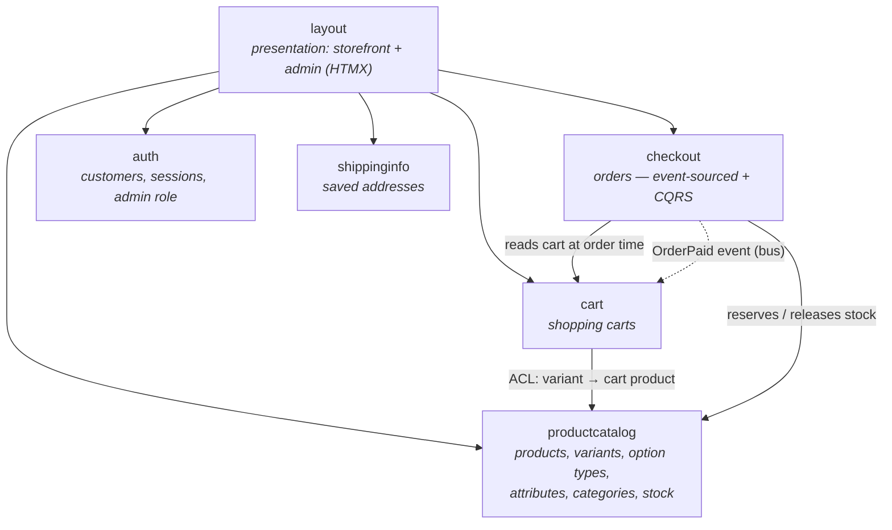

# go-ecommerce

GoCommerce is an e-commerce application written in Go and HTMX. The goal of this project is to show good practices and examples of some domain or technical decisions.

The whole application is split into a few major parts:

* [backend](./backend) - the backend implementation that exposes an API for the frontend with frontend written in HTMX
* [docs](./docs) - documentation that's more high-level (ADRs, architecture diagrams, etc)

If you find anything that you can improve or add - feel free to talk about it in the [discussions](https://github.com/bkielbasa/go-ecommerce/discussions) or create a [pull request](https://github.com/bkielbasa/go-ecommerce/pulls).

The project is a very early stage so there's a lot of work to do so every contribution is welcome!

## Features

**Storefront**
- "New arrivals" homepage; full filterable catalog at `/products`.
- Top menu with category links, cart and account/log out.
- Faceted filters per category (numeric ranges + enum checkboxes), scoped to the active category.
- Variant selectors (e.g. Color / Size) on product pages; add-to-cart over HTMX.
- Customer accounts: orders history, saved shipping addresses, password change.
- Checkout with personal pickup / courier / flat-rate shipping and card / PayPal / cash-on-delivery payment.

**Admin panel** (`/admin`, seeded user `admin@example.com` / `Admin123!`)
- Dashboard with store counts.
- Products: list, create (simple or with option types + variants), edit core fields, per-variant SKU/price/stock/image, add/edit/delete variants, manage option types on existing products (with consistent cascades), assign categories, attributes and an attribute set, delete.
- Categories, attribute types and attribute sets: full CRUD.
- Orders: list all, view detail, admin-cancel.
- Dedicated admin shell (sidebar layout) separate from the storefront.

## Context map

The backend is organised as a set of DDD bounded contexts. Each context owns its
data and is split into `domain` (entities, value objects, invariants), `app`
(application services / use cases), and `adapter` (persistence — a Postgres and
an in-memory implementation), with a thin `bounded_context.go` wiring it together.
The `layout` context is the presentation layer (HTMX storefront + admin panel);
it depends on the others through small, locally-defined interfaces.



| Context | Responsibility | Talks to |
| --- | --- | --- |
| **productcatalog** | Products, variants, option types, filterable attributes, categories, and stock reservation. No dependencies on other contexts. | — |
| **cart** | Session-scoped shopping carts. Resolves a variant id into its own product notion through an anti-corruption layer over productcatalog. | productcatalog (sync, ACL) |
| **checkout** | Orders as an event-sourced aggregate with a separate CQRS read side. Snapshots the cart, reserves stock, records payment, and publishes an `OrderPaid` integration event. | cart, productcatalog (sync); cart (async, via event bus) |
| **auth** | Customers, sessions, password policy, and the admin role. Standalone. | — |
| **shippinginfo** | Customers' saved shipping addresses. Standalone. | — |
| **layout** | HTTP presentation: the HTMX storefront and the admin panel. Orchestrates every context through narrow interfaces. | all contexts |

Cross-context integration is mostly synchronous through anti-corruption interfaces
defined at the composition root (`backend/cmd/web/main.go`). The one decoupled
path is an in-process event bus (`backend/internal/eventbus`): checkout publishes
`OrderPaid` after a successful payment and the cart context subscribes to empty
the basket, so checkout never calls the cart directly for that side effect.

The shared vocabulary used across these contexts is collected in the [ubiquitous-language glossary](./docs/glossary.md).


## Quick start

The easiest way of running everything is using the `docker-compose`.

```sh
docker-compose up
```

You'll have to wait some time to download all dependencies and build everything but after it, everything should be up and running.
