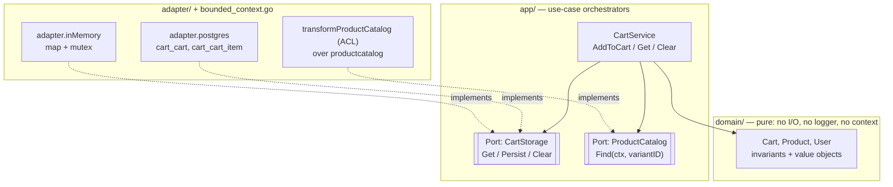

# Cart context — a hexagonal-architecture walkthrough

Most of the project's bounded contexts follow the same shape: a `domain/`
holds value objects and business rules, an `app/` declares ports and
orchestrates use-cases, and `adapter/` packages provide concrete adapters
that satisfy the ports. This Readme uses the **cart** context as the
exemplar — it's the smallest one — to make the hexagonal-architecture
pattern concrete.

## The picture



The arrow direction is the point: `app/` depends on `domain/`, and
`adapter/` depends on `app/`. Nothing in `domain/` or `app/` knows the
adapters exist — they only know the port interfaces.

## Where each piece lives

### Domain (`backend/cart/domain/`)
- [`cart.go`](./domain/cart.go) — the `Cart` aggregate root. Pure
  value-object + invariants: adding the same `Product` increments an
  existing line; adding a product in a different `Currency` than the
  cart's current line returns `ErrCurrencyMismatch`; adding a non-positive
  quantity to a missing line is a no-op.
- [`product.go`](./domain/product.go) — the cart's own `Product` (just
  enough to render a line: `id`, `name`, `price`). This is the **cart's**
  notion of a product. The productcatalog context has a richer `Product`
  and a separate `Variant` — the ACL below translates between them.
- [`user.go`](./domain/user.go) — the cart's `User` type; a thin wrapper
  around a session id (the `cart_id` cookie value). Not the same thing as
  `auth.Customer` — see the glossary's `User vs Customer` entry.
- Domain depends on NOTHING else in the project. It imports no `app/`,
  no `adapter/`, no logger, no `context` — only the standard library.

### App / ports (`backend/cart/app/cart.go`)
- `CartService` orchestrates use-cases.
- Two **ports** declared as Go interfaces:
  - `CartStorage{Get, Persist, Clear}` — the persistence port.
  - `ProductCatalog{Find(ctx, variantID) (domain.Product, error)}` — the
    information-from-another-context port.
- `CartService.AddToCart(...)` is the canonical use case: resolve the
  variant id via the `ProductCatalog` port, fetch (or create) the cart via
  the `CartStorage` port, mutate the aggregate via `Cart.Add`, persist.

### Adapters

**Storage** (`backend/cart/adapter/`)
- [`postgres.go`](./adapter/postgres.go) — production adapter. Reads and
  writes `cart_cart` + `cart_cart_item`, wrapping `Persist` in a
  transaction.
- [`in_memory.go`](./adapter/in_memory.go) — in-memory adapter for unit
  tests: a `map[string]*domain.Cart` guarded by a mutex.

Both implement `CartStorage`. The point of hex arch: the domain doesn't
know which one runs.

**Anti-Corruption Layer** (`backend/cart/bounded_context.go`)
- `transformProductCatalog` is the adapter for the `ProductCatalog` port.
- It depends on `productcatalog/domain` types (`Product`, `Variant`,
  `ErrProductNotFound`) but translates them at the boundary so cart's
  domain receives ONLY cart's own types. The variant's price currency is
  re-validated through `domain.NewCurrency`, the stock flag is mapped to
  `domain.ErrOutOfStock`, and the line name is composed from the product
  name plus the variant's option label.
- This is exactly the ACL pattern; it satisfies the port.

## What "hex" buys us in practice

Five concrete properties this layout gives us:

1. **Tests are fast and deterministic.** `cart_test.go` builds a
   `CartService` against `adapter.NewInMemory()` and a `mockProductCatalog`
   declared inline — no database, no productcatalog wiring.
2. **The domain compiles without the database driver.**
   `go test ./cart/domain/...` does not pull in `lib/pq`; a regression
   in the Postgres driver cannot break the domain tests.
3. **Swapping the cart's persistence is a one-file change.** If we wanted
   a Redis cart, we'd add `adapter/redis.go` implementing the three
   `CartStorage` methods and wire it in `bounded_context.go::New`. The
   domain and the application service would not change.
4. **Cross-context coupling is centralised.** The cart only sees the
   productcatalog through `transformProductCatalog`. If productcatalog
   renames `Variant.Label` or adds a field, the blast radius is that one
   function.
5. **Reading the code is layered.** `domain/` says "what a cart can do";
   `app/` says "the steps to do it"; `adapter/` says "how to talk to the
   outside world." A new contributor can read top-down.

## Try it

The unit-test suite uses the in-memory adapter via a build-tag switch
([`setup_short_test.go`](./setup_short_test.go) vs
[`setup_integration_test.go`](./setup_integration_test.go)):

```sh
# unit tests — in-memory adapter, no DB needed
go test ./cart/...

# same tests against a real Postgres
go test ./cart/... -tags=integration
```

Both runs exercise the same `CartService` code paths and the same
domain rules — only the `CartStorage` implementation differs.

## See also

- [README.md — Context map](../../README.md) for how this context relates
  to the others.
- [docs/glossary.md](../../docs/glossary.md) for the vocabulary —
  **Port**, **Adapter**, **Anti-Corruption Layer**, **Bounded context**.
