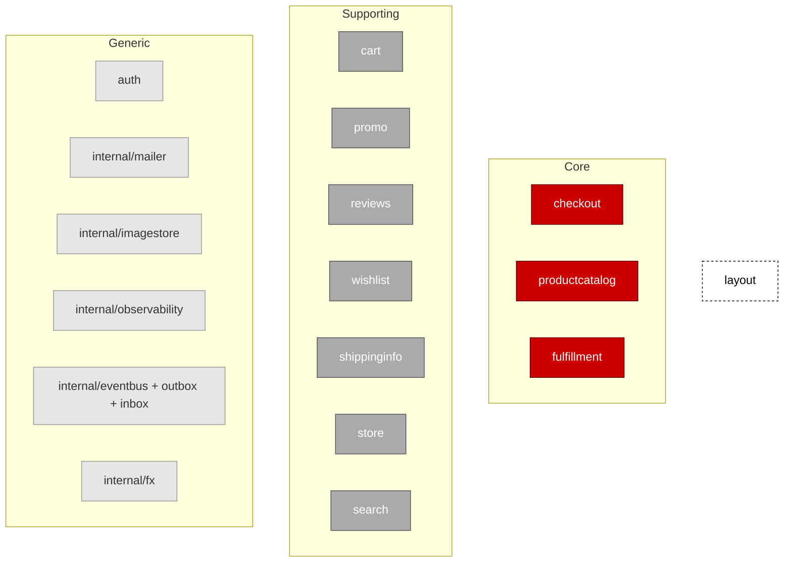

# Subdomain classification

> A DDD context map shows *what* contexts exist. A subdomain classification
> shows *which ones matter most*. Core subdomains are where the business
> differentiates; Supporting subdomains are necessary but not unique;
> Generic subdomains are solved-elsewhere problems we shouldn't reinvent.
>
> This document classifies every context in this codebase. It complements
> [README.md's context map](../README.md) (which shows the contexts) and
> [docs/glossary.md](glossary.md) (which defines the vocabulary).

## TL;DR

Three Core contexts (`checkout`, `productcatalog`, `fulfillment`), seven
Supporting contexts, and a long tail of Generic infrastructure. See the
[Visual](#visual) below for a colour-coded map.

## How to read the classification

Core subdomains get the best designers, the deepest domain models, and the
heaviest patterns — event sourcing, CQRS, process managers, careful
invariants. Supporting subdomains can be honest CRUD with a domain layer
thin enough to read in one sitting. Generic subdomains should be a thin
wrapper around a library (or an off-the-shelf service) wherever possible.

The classification is about **where the business creates value**, not about
which code is technically harder. A clever cache is not Core; a boring
catalogue of products that a customer actually shops is.

## Classification

### Core

- **checkout** — the commercial lifecycle of an order. Event-sourced because
  the business needs an audit-grade history of every state change (place,
  pay, ship, refund, cancel). CQRS because the read shapes
  ("today's sales", "a customer's order list") diverge sharply from the
  write shape (the `Order` aggregate). The pricing math, the snapshotting,
  the upcaster on `OrderPlaced` v1→v2, the `OrderPaid` integration event,
  the reservation sweeper — they all live here. This is the context where
  bugs cost money directly.
- **productcatalog** — the catalogue is what makes a store *this* store.
  The `Product` / `Variant` / `OptionType` / `Category` / `AttributeType`
  /`AttributeSet` model is rich, with careful invariants (a variant's
  options must cover every one of its product's option types; deleting an
  option type must cascade through variants safely; filterable attributes
  must agree with the active category's set). Also owns stock reservation
  through `StockMovement`, which is load-bearing for the order flow.
- **fulfillment** — the operational workflow that *executes* the commercial
  promise. Lives in a separate context (per the Process Manager pattern)
  because commercial state and operational state evolve independently:
  finance owns "paid → refunded", the warehouse owns "scheduled → labeled
  → shipped → delivered". This is the codebase's reference example of a
  saga-style process manager reacting to `checkout.OrderPaid`.

### Supporting

- **cart** — session-scoped, ephemeral, intentionally simple. Some commerce
  platforms ship a cart service you could buy; ours is small enough to
  keep. The load-bearing piece is the ACL over productcatalog
  (`transformProductCatalog`) — that translation is the only thing
  protecting cart from catalogue churn.
- **promo** — promo codes are a near-universal feature; this implementation
  is mostly CRUD plus a Specification-pattern rules engine
  (`NotAnonymous`, `WithinValidityWindow`, `UnderMaxUses`,
  `UnderPerCustomerLimit`). Differentiating *campaigns* could become Core
  one day; differentiating *code redemption rules* hasn't.
- **reviews** — gives customers a voice; verified-buyer gating is the only
  non-trivial bit, and even that is one ACL port (`VerifiedBuyerSource`)
  away from being CRUD.
- **wishlist** — variant-keyed lists per customer. Pure CRUD plus an index.
- **shippinginfo** — saved customer addresses with a `isDefault` flag.
  Pure CRUD.
- **store** — multi-store + per-host currency. Demo-illustrative; in a
  real multi-tenant business this could grow into Core (per-store pricing,
  per-store catalogue, per-store tax rules) but today it's a thin
  request-scoped facade.
- **search** — Open Host Service over Postgres full-text. We built our own
  rather than buying Algolia / Meilisearch / Elastic. At scale this is
  textbook "swap for a dedicated engine"; the OHS shape (`Document`,
  `Indexer`, `Querier`) was designed precisely so that swap stays cheap.

### Generic

- **auth** — login, sessions, password policy, admin role. Standard
  problem with well-known answers. We own it because owning identity
  simplifies the demo, but in production this is the textbook
  "use Auth0 / Cognito / Keycloak" case.
- **internal/mailer** — SMTP. Solved problem, many providers.
- **internal/imagestore** — file storage. Trivially replaceable with
  S3 / GCS / R2.
- **internal/observability** — OpenTelemetry plumbing. Library code, not
  domain.
- **internal/eventbus / outbox / inbox / idempotency** — infrastructure
  patterns that any event-driven system needs.
- **internal/fx** — currency-rate plumbing; in production this is a feed
  from a real provider.
- **internal/ratelimit / eventcatalog / storectx / sharedkernel / fx /
  dependency / application / https** — utility plumbing that supports
  every other context without being part of any one of them.

### Presentation (not a subdomain)

- **layout** — the HTMX storefront and admin shell. Not a subdomain in the
  DDD sense; it's the UI layer that orchestrates the rest, conforming to
  each context's domain types (see the README's Conformist edge).

## Visual

**Legend:**

- **Red** (`core`) — strategic, where the business differentiates.
- **Grey** (`support`) — necessary but not unique; honest CRUD or a thin
  domain layer.
- **Light grey** (`generic`) — solved problem; prefer a library or a
  managed service.
- **Dashed outline** (`presentation`) — the UI layer, not a subdomain.

## How this changes our thinking

When adding a new feature, ask "what subdomain does this fall in?" Core
gets full domain modeling, event-storming, the deepest tests, and the
most careful code review. Supporting gets less ceremony — a domain layer,
yes, but no event sourcing unless there's a concrete audit requirement.
Generic gets a thin wrapper around a library and a clean port so it can
be swapped for a managed service later.

The classification is a *budgeting tool*: it tells you where to spend
design attention and where to spend less.

## Cross-references

- [README.md — Context map](../README.md)
- [docs/glossary.md](glossary.md)
- [docs/adr](adr/Readme.md)
